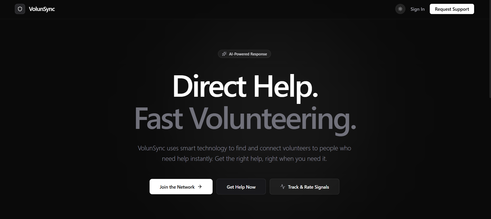
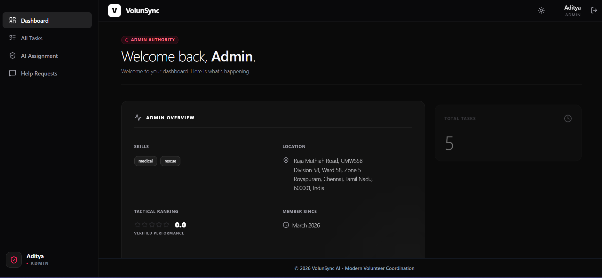
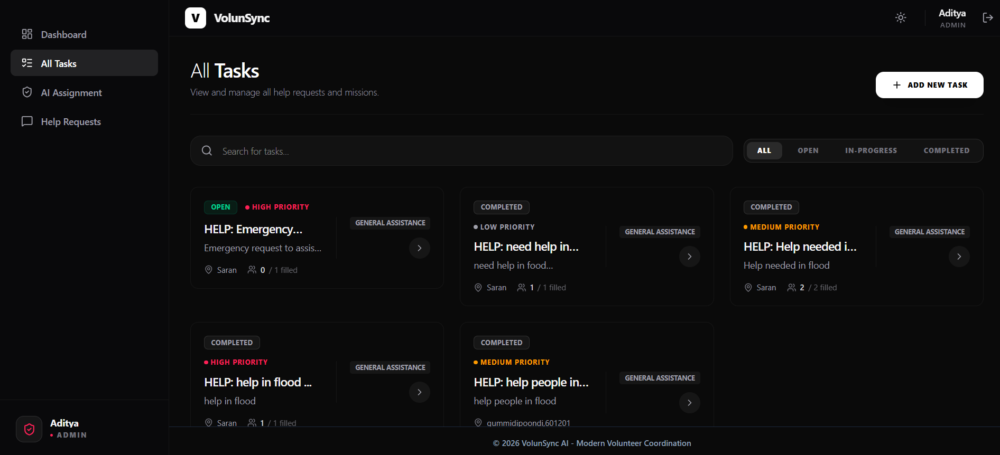
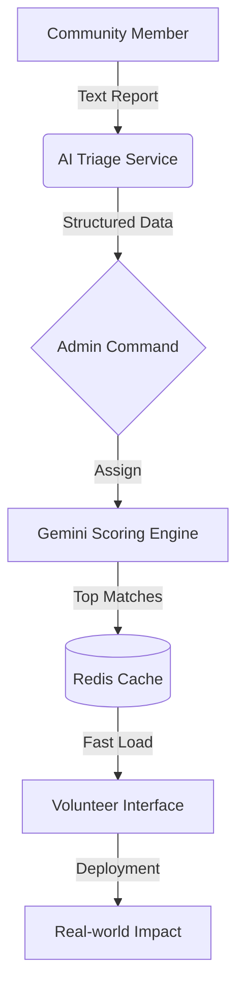

# 🦾 VolunSync: AI-Powered Crisis Coordination & Resource Management

> **Bridging the gap between community needs and volunteer rapid-response using Google Gemini AI.**

VolunSync is a state-of-the-art disaster response platform designed to streamline community help requests and volunteer assignments. By leveraging the power of **Google Gemini-3-Flash**, it automatically triages emergency reports, extracts mission-critical data, and matches the most qualified volunteers in the vicinity.

---

## 📸 Platform Preview
<div align="center">
  
  
  
</div>

---

## 🚀 Key Features

### 🧠 1. AI Triage & Analysis (Powered by Gemini-3-Flash)
*   **Automatic Extraction**: Converts raw text reports (social media posts, tweets, transcripts) into structured operational missions.
*   **Intelligent Scoring**: Ranks volunteer matches based on skill alignment, urgency, and distance.
*   **Sentiment & Priority Detection**: Automatically categorizes tasks from 'Low' to 'Emergency' severity.

### 📍 2. Geo-Strategic Deployment
*   **Radius Filtering**: Dynamically identifies volunteers within a 10km radius of the incident.
*   **Live Reverse Geocoding**: Real-time address synchronization for precise staging areas.

### 🛡️ 3. Tactical Command Centers
*   **Admin HUD**: Complete overview of intelligence signal requests, active missions, and personnel status.
*   **Volunteer Portal**: Personalized mission feed with one-click acceptance and status updates.

### ⚡ 4. High-Performance Architecture
*   **Redis Caching**: Sub-millisecond data retrieval for high-traffic scenarios using Upstash.
*   **Concurrent Management**: Real-time assignment tracking to prevent resource overlap.

---

## 🛠️ Technology Stack

**Frontend:**
- **React.js & Vite**: Ultra-fast component rendering.
- **Tailwind CSS**: Modern, premium styling with glassmorphism.
- **Framer Motion**: Smooth, high-end micro-animations.
- **Lucide Icons**: Intuitive tactical iconography.

**Backend:**
- **Node.js & Express**: Robust API architecture.
- **MongoDB & Mongoose**: Scalable document storage.
- **Upstash Redis**: Global caching and performance optimization.
- **Google Generative AI SDK**: Core AI logic for triage and scoring.

---

## ⚙️ Local Configuration

### 1. Prerequisites
- Node.js (v18+)
- MongoDB Atlas Account
- Upstash Redis Account
- Google AI Studio API Key (Gemini)

### 2. Environment Variables (`.env`)

**Backend (`/backend/.env`):**
```env
MONGODB_URI=your_mongodb_connection_string
REDIS_URL=your_upstash_redis_url
GEMINI_API_KEY=your_gemini_api_preview_key
ACCESS_TOKEN_SECRET=your_long_secret_string
REFRESH_TOKEN_SECRET=your_long_secret_string
PORT=5000
```

**Frontend (`/frontend/.env`):**
```env
VITE_API_BASE_URL=http://localhost:5000/api
```

### 3. Installation
```bash
# Install root dependencies
npm install

# Install all workspace dependencies
npm run install-all

# Launch Dev Environments (Parallel)
npm run dev
```

---

## 🚢 Deployment Strategy

### Backend (Render)
1. Set **Root Directory** to `backend`.
2. **Build Command**: `npm install && npm run build`.
3. **Start Command**: `npm start`.

### Frontend (Vercel)
1. Set **Root Directory** to `frontend`.
2. **Build Command**: `npm run build`.
3. **Output Directory**: `dist`.

---

## 📐 Architecture Overview



---

## 📝 License
Distributed under the MIT License. See `LICENSE` for more information.

---

<p align="center">
  Built with ❤️ for the Google AI Hackathon
</p>
